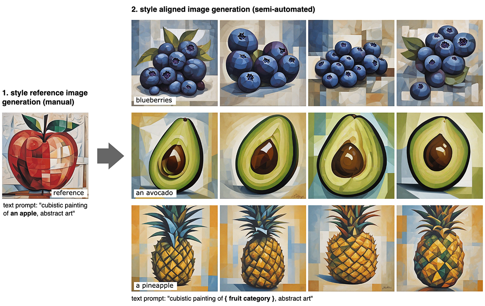

# fruit-SALAD


### Project Page: [https://style-aligned-artwork-datasets.github.io](https://style-aligned-artwork-datasets.github.io/)

**fruit-SALAD** is a synthetic image dataset with 10,000 generated images of fruit depictions. This combined semantic category and style benchmark comprises 100 instances each of 10 easily recognizable fruit categories and 10 easily distinguishable styles.

This repository contains the code to reproduce the fruit-SALAD dataset. Please see the Jupyter notebook [fruit-SALAD_pipeline.ipynb](fruit-SALAD_pipeline.ipynb) for more details.

---

## About

The carefully designed Style Aligned Artwork Dataset (SALAD) provides a controlled and balanced platform for the comparative analysis of similarity perception of different computational models. The SALAD framework allows the comparison of how these models perform semantic category and style recognition tasks, going beyond the level of anecdotal knowledge, making them robustly quantifiable and qualitatively interpretable.

We used [Stable Diffusion XL](https://arxiv.org/abs/2307.01952) and [StyleAligned](https://arxiv.org/abs/2312.02133) to create the fruit-SALAD by carefully crafting text prompts and overseeing the image generation process. Original code by [Amir Hertz](https://github.com/amirhertz), [Andrey Voynov](https://github.com/anvoynov) and [Yuvraj Sharma](https://github.com/yvrjsharma). See [github.com/google/style-aligned](https://github.com/google/style-aligned/).

---

## Dataset Structure

The dataset is organized as follows:

```
fruit-SALAD_100/
    0_0.jpg
    0_1.jpg
    ...
    9_9.jpg
    0_0.json
    0_1.json
    ...
    9_9.json
```

- All images are stored directly in the `fruit-SALAD_100` directory.
- Each image file is named as `<category_id>_<style_id>.jpg`, where:
  - `category_id` is an integer from 0 to 9, representing the fruit type.
  - `style_id` is an integer from 0 to 9, representing the depiction style.
- For every image, there is a corresponding JSON annotation file with the same name (but `.json` extension).

### Category and Style Mapping

| category_id | Category Name | style_id | Style Name         |
|-------------|--------------|----------|--------------------|
| 0           | blueberries  | 0        | sketch             |
| 1           | fig          | 1        | oil painting       |
| 2           | strawberry   | 2        | hard painting      |
| 3           | apple        | 3        | mosaic cartoon     |
| 4           | orange       | 4        | knitted            |
| 5           | pineapple    | 5        | wooden             |
| 6           | bananas      | 6        | pencil drawing     |
| 7           | pear         | 7        | plastic            |
| 8           | avocado      | 8        | real               |
| 9           | kiwi         | 9        | multi real         |

---

## JSON Annotation Format

Each image has a corresponding JSON file containing its semantic and style information. The structure is as follows:

```
{
  "category_id": 3,
  "category_name": "apple",
  "subcategory_id": 8,
  "subcategory_name": "real apple"
}
```

- `category_id`: Integer, the main fruit category (0-9).
- `category_name`: String, the name of the fruit.
- `subcategory_id`: Integer, the style category (0-9).
- `subcategory_name`: String, the style and fruit combined (e.g., "real apple", "oil painting fig").

---

## Download

You can access the complete fruit-SALAD_10k dataset at [Zenodo](https://doi.org/10.5281/zenodo.11158522).

```
Ohm, T. (2024). fruit-SALAD [Data set]. Zenodo. https://doi.org/10.5281/zenodo.11158522
```

---

## Citation

See our research paper on [Scientific Data](https://www.nature.com/articles/s41597-025-04529-4).

```
@article{ohm2025FruitSALAD,
  title = {fruit-SALAD: A Style Aligned Artwork Dataset to reveal similarity perception in image embeddings},
  volume = {12},
  issn = {2052-4463},
  url = {https://doi.org/10.1038/s41597-025-04529-4},
  doi = {10.1038/s41597-025-04529-4},
  number = {1},
  journal = {Scientific Data},
  author = {Ohm, Tillmann and Karjus, Andres and Tamm, Mikhail V. and Schich, Maximilian},
  year = {2025},
  pages = {254},
}
```


